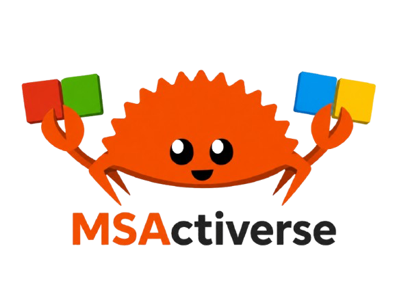

<div align="center">
  
</div>

<h1 align="center">MSActiverse</h1>
<div align="center">
  <a href="https://github.com/mrrabyss/MSActiverse#features">Features</a>
  <a href="https://github.com/mrrabyss/MSActiverse#installation">Installation</a>
  <a href="https://github.com/mrrabyss/MSActiverse#usage">Usage</a>
  <a href="https://github.com/mrrabyss/MSActiverse#bugs--issues">Bugs & Issues</a>
  <a href="https://github.com/mrrabyss/MSActiverse#credits">Credits</a>
  <a href="https://github.com/mrrabyss/MSActiverse#license">License</a>
</div>
<p align="center">A lightweight, fast, and easy-to-use activation tool for Windows 10/11 and Microsoft Office 2016–365.</p>

---

## Features

- **Lightweight** — The entire tool is under 8 MB.
- **Fast** — Two clicks and your Windows or Office is activated.
- **Easy to use** — A clean TUI and a one-line install script get you started in seconds.
- **Permanent activation** — Windows and Office stay activated indefinitely, no re-runs needed.

---

## Installation

### Option 1 — One-line PowerShell install (recommended)

Open PowerShell and run:

```powershell
iwr https://raw.githubusercontent.com/mrrabyss/MSActiverse/HEAD/install.ps1 | iex
```

This automatically downloads and runs the tool. No manual steps required.

### Option 2 — Manual download

Head to the [Releases](https://github.com/mrrabyss/MSActiverse/releases) tab and download the `.exe` matching your architecture — for example, `MSActiverse-v1.0.0-x86_64.exe`. Then right-click and **Run as administrator**.

---

## Usage

When you launch MSActiverse, you'll be presented with four options:

1. **Windows Activation (HWID)**
2. **MS Office Activation (Ohook)**
3. **Learn More**
4. **Exit**

### Windows Activation

> Supported on Windows 10 and Windows 11 only.

MSActiverse auto-detects your Windows edition and applies the necessary changes to activate it. Command output is shown directly in the terminal so you can confirm success or catch any errors.

### Office Activation

> Supported from Office 2016 through Office 365.

MSActiverse auto-detects your installed Office edition and activates it accordingly. As with Windows activation, all command output is displayed in the terminal.

---

## Bugs & Issues

MSActiverse is in active development and may contain bugs. If you run into a bug or unexpected behavior, please open a report on the [Issues](https://github.com/mrrabyss/MSActiverse/issues) page — it's appreciated.

---

## Credits

- HWID method — [massgrave.dev](https://massgrave.dev)
- Ohook concept — [asdcorp/ohook](https://github.com/asdcorp/ohook)

---

## License

This project is licensed under the **GNU GPL v3**. See `LICENSE` for details.